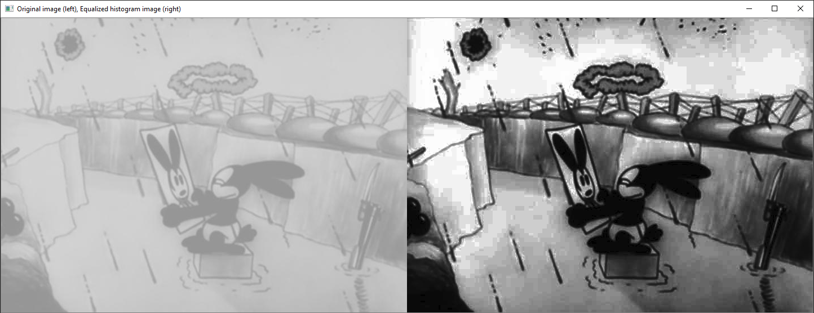
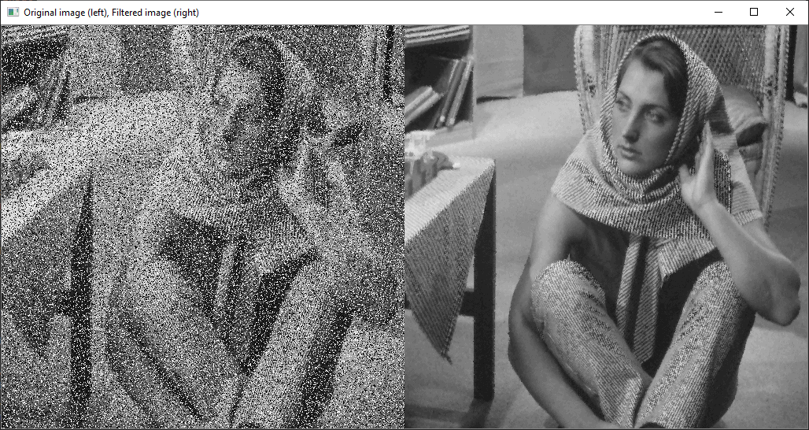
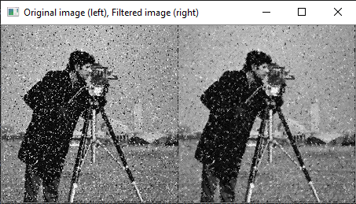
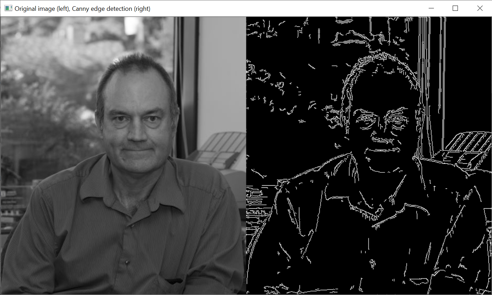

# Image processing scripts

The <code><exec_mode></code> argument has two possible values : "show" to visualize the result without saving as in the screenshots below and "save" to save the resulting image in the same directory as the source image.

If the image is too big, the "show" mode will not be adapted (the image will go out of the screen, I did not handle that case yet) so use "save".

## Histogram equalization

Apply basic histogram equalization to the input image ([source](https://en.wikipedia.org/wiki/Histogram_equalization)). Histogram equalization is method of contrast adjustment of an image by stretching out the intensity range of an image (flattening its intensity histogram). For a step by step exploration of the concept see the dedicated notebook.

Usage :
    <pre><code>python histeq.py <exec_mode> <path_to_image></code></pre>

Example result :

Limitations : this method considers the global intensity of the picture and has some undesired impact on the contrast, the brightness, etc. For more elaborate methods, consider usinge adaptive methods like the [CLAHE algorithm] (https://en.wikipedia.org/wiki/Adaptive_histogram_equalization#Contrast_Limited_AHE) (contrast limited adaptive histogram equalization) or other developed methods that tackle various issues of this basic one.

## Median filtering / Adaptive median filtering

Apply median filtering or adaptive median filtering to the input image ([source](https://en.wikipedia.org/wiki/Median_filter)). Median filtering is a method of image smoothing / noise removal by applying a non-linear filter which selects the median pixel value in the sliding window. Adaptive median filtering is the same idea but with an adaptive window size : we slide an initial window of size <code><w_0></code> (3 by default) and we can increase its size up to <code><w_max></code>. (see code for more details and implementation).

Usage :
    <pre><code>python admedfilter.py <exec_mode> <path_to_image> <w_max> (<w_0>)</code></pre>

Example result that works well :

Example result that works less well :

Limitations : it doesn't work on every kind of speckle noise, and for now it doesn't produce a satisfying result on one RGB image that was tested. To explore this further, make a code that generates a speckle noise and see performance with respect to its intensity and to have more examples of color images with noise

# Canny edge detection

Apply the Canny edge detection algorithm on a grayscale image ([source](https://en.wikipedia.org/wiki/Canny_edge_detector)). The steps of the algorithm are : smooth the image -> calculate intensity gradient magnitude and direction -> apply non max suppression on intensity gradient magnitudes -> apply hysteresis thresholding using <code><hyst_min></code> and <code><hyst_max></code> to keep or discard some edges. For more details check section 3.3 of Filtering and Edge detection notebook. 

Usage : 
    <pre><code>python canny.py <exec_mode> <path_to_image> <hyst_min> <hyst_max></code></pre>

Example result :

